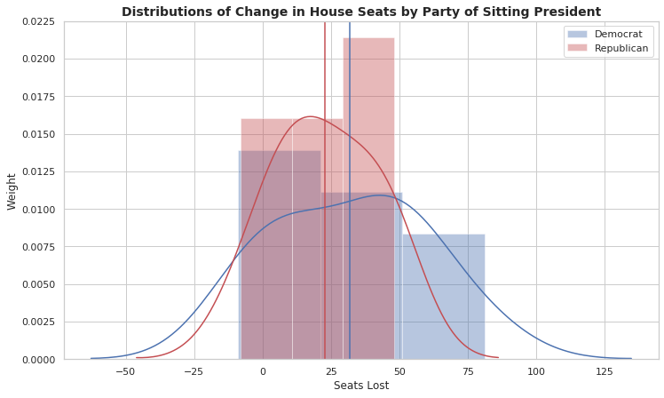

## Predicting Midterm Elections

## Exploratory Data Analysis

- What data are we dealing with?
- How have we explored the data (initial explorations, data cleaning and reconciliation, etc)? 
- Visualizations and captions that summarize the noteworthy findings of the EDA.
- A revised project question based on the insights you gained through EDA (specific to data).
- A baseline model.

### Project Goal 
The primary goal of this project is to explain the outcomes of the 2018 midterm
elections in the House. Any piece of information from before election day can be used to perform
this analysis, but the suggested feature set should include past elections, polling data, and demographic information of congressional districts

### House District Candidate Data

### Markdown

### How do states traditionally vote?

### House Seat Changes by President

**Are there differences in House seats lost by Democratic vs Republican Presidents?**

### Data Cleaning and Merging

**Trim our features into something useable for an exploratory regression**
We see that candidates outside the major two parties basically never win - so let's only look at the main two parties.

We also need to merge rows for tickets that were competing in the same election (where district and year are equal), as our predictive task will be predicting the winner.

We assign boolean values for party - democrat = 0, republican = 1. Our winner variable is changed here from representing success to representing the party that won, once we merge the tickets.
Markdown is a lightweight and easy-to-use syntax for styling your writing. It includes conventions for

We need to turn some stats into percentages not absolute numbers by dividing by total population.

Otherwise any normalization applied across the whole data set won't account for differences in population between elections

## Modeling the Data

### Exploratory Baseline Model

**We produce a simple exploratory linear regression to get a feel for what predictors might be important**

After producing this exploratory regression, we bootstrap to build up a map of p values for our predictors to get a sense of which predictors will be the most important for us.

We can see that many of our predictors are not very significant. To look into this further, we bootstrap across many samples of the data to produce a more accurate picture of which predictors are significant in our linear regression.

### Lasso Model

We use a Lasso linear regression to try perform some variable selection on the data.

### Ridge Model

We use a Ridge linear regression model.

### Random Forests 

### Boosting

### Neural Networks

## Interpretation

## Conclusion
